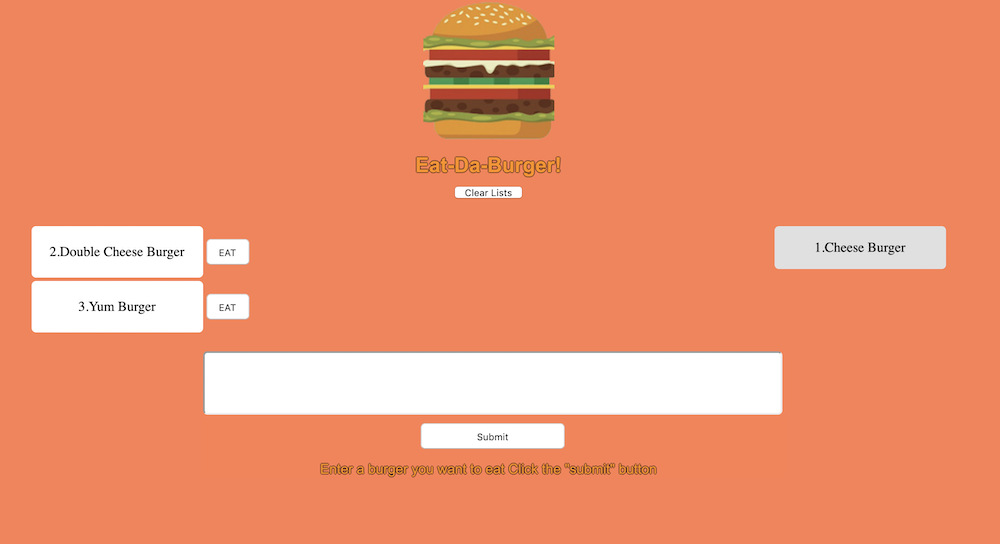

# EatDaBurger
## [Live Link] (https://eat-the-burger-mvc.herokuapp.com/)

# MVC-Eat-Da-Burger
Assignment 11 for UfT fullstack bootcamp focusing on making an MVC app using node, express, handlebars and mysql.

## Getting Started

Inside this repo there are mysql seed files to build a starting repo, the logic has been set for a clearDB configuration on heroku.

## Goals
Learning the basics of MySQl
Learning CRUD!  Create ,Read, Update and Delete.

* <b>Create</b>: Using the form.  
* <b>Read</b>: Diplay the data in the view.  
* <b>Update</b>: With devour button.  
* <b>Delete</b>: With the reset orders button.

